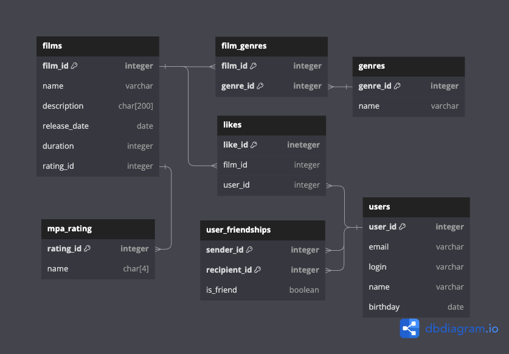

# java-filmorate 
### Сервис для оценки фильмов.

### Схема БД и примеры запросов для основных операций:

### · связанных с фильмами: 
#### Получение списка всех фильмов: 
SELECT *
FROM films
GROUP BY film_id
ORDER BY film_id;

#### Получение фильма по его id: 
SELECT *
FROM films
WHERE film_id = ?;

#### Получение n-самых популярных фильмов:
SELECT films.name,
       COUNT(likes.user_id) AS likes_count
FROM films
INNER JOIN likes ON films.film_id=likes.film_id
GROUP BY films.name
ORDER BY likes_count DESC
LIMIT ?;

#### Добавление нового фильма:
INSERT INTO films (name, description, releaseDate, duration, rating_id)  
VALUES (?, ?, ?, ?, ?);

#### Обновление данных по фильму:
UPDATE films
SET releaseDate = '2000-11-11'
WHERE film_id = ?;

#### Удаление фильма по id:
DELETE FROM films
WHERE film_id = ?;

#### Добавление лайка пользователя к фильму:
INSERT INTO LIKES (film_id, user_id) 
VALUES (?, ?);

#### Удаление лайка пользователя к фильму:
DELETE FROM likes
WHERE film_id = ?
AND user_id = ?;

###
###
### · связанных с пользователями:
#### Получение списка всех пользователей: 
SELECT *
FROM users
GROUP BY user_id
ORDER BY user_id;

#### Получение пользователя по его id:
SELECT *
FROM users
WHERE user_id = ?;

#### Добавление нового пользователя:
INSERT INTO users (email, login, name, birthday)  
VALUES (?, ?, ?, ?);

#### Обновление данных пользователя:
UPDATE users
SET birthday = '2000-11-11'
WHERE user_id = ?;

#### Удаление пользователя по его id:
DELETE FROM users
WHERE user_id = ?;

###
###
### · связанных с рейтингами:
#### Получение списка всех рейтингов:
SELECT *
FROM mpa_rating
GROUP BY rating_id
ORDER BY rating_id;

#### Получение рейтинга по его id:
SELECT *
FROM mpa_rating
WHERE rating_id = ?;

#### Удаление рейтинга по его id:
DELETE FROM mpa_rating
WHERE rating_id = ?;

###
###
### · связанных с жанрами:
#### Получение списка всех жанров:
SELECT *
FROM genres
GROUP BY genre_id
ORDER BY genre_id;

#### Получение жанра по его id:
SELECT *
FROM genres
WHERE genre_id = ?;

#### Удаление жанра по его id:
DELETE FROM genres
WHERE genre_id = ?;